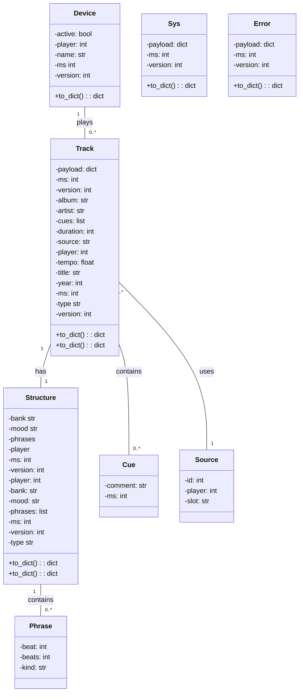

# UML class diagramm

## Classes

### Device

### Track

### Structure

### Beat

```mermaid
classDiagram
class Device {
        -active: bool
        -player: int
        -name: str
        -ms int
        -version: int
        +to_dict(): dict
    }
    class Sys {
        -payload: dict
        -ms: int
        -version: int
        +to_dict(): dict
    }

    class Error {
        -payload: dict
        -ms: int
        -version: int
        +to_dict(): dict
    }

    
    class Track {
        -payload: dict
        -ms: int
        -version: int
        +to_dict(): dict
    }

    class Structure {
        -bank str
        -mood str
        -phrases
        -player
        -ms: int
        -version: int
        +to_dict(): dict
    }

    class Cue {
        -comment: str
        -ms: int
    }

    class Source {
        -id: int
        -player: int
        -slot: str
    }

    Device "1" -- "0..*" Track : plays
    Track "1" -- "1" Structure : has
    Track "0..*" -- "1" Source : uses
    Track "0..*" -- "0..*" Cue : contains

    class Track {
        -album: str
        -artist: str
        -cues: list
        -duration: int
        -source: str
        -player: int
        -tempo: float
        -title: str
        -year: int
        -ms: int
        -type str
        -version: int
        +to_dict(): dict
    }

    class Structure {
        -player: int
        -bank: str
        -mood: str
        -phrases: list
        -ms: int
        -version: int
        -type str
        +to_dict(): dict
    }

    class Phrase {
        -beat: int
        -beats: int
        -kind: str
    }

    Structure "1" -- "0..*" Phrase : contains
```
