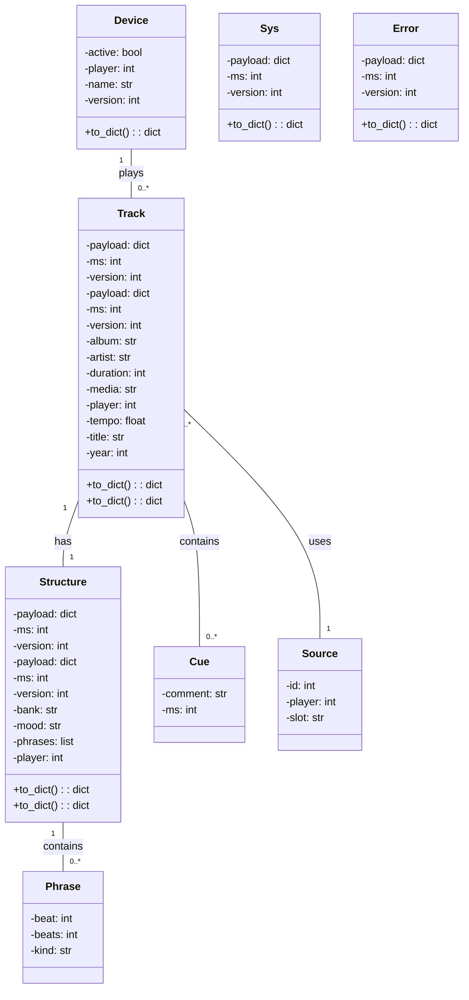

# vizlink-to-python

## Project description

This project utilizes [Vizlink][1] to read data from the ProDJLink network, transmits the data as .json to a Python script, and will be working with standard DMX lighting software. The project is still in development and is not yet ready for production use.

> __Disclaimer__: This project is not affiliated with AlphaTheta/Pioneer DJ Corp. or its related companies in any way and has been developed independently. Vizlink to Python is licensed under the [MIT license][license-link]. The maintainers of this project are not liable for any damages to your data, as this is an experimental project.  
>__Editor’s Warning__: Using any under-development tool like this should be tested very thoroughly before relying on it for your next big DJ set. There is also always a chance that Pioneer DJ could close the loopholes that allow this to work in a future firmware update to CDJs – so update with caution.

## Table of contents

1. Introduction
2. Requirements
3. Installation
4. Usage
5. Equipment

## Introduction

Inspired by a part in the great manual of Beat Link Trigger about [writing played songs in a textfile][2] i want to work with analyized data from Rekordbox with my played songs from the [Pioneer XDJ-XZ][3] in combination with Standard-DMX-Lighting-Software.

One further option is to show the playlist live on a Website

## Requirements

- Full ProDJLink compatible Hardware
- Vizlink
- Python 3.x

## Installation

1. clone this repository: `git clone https://github.com/hfanieng/vizlink-to-python`
2. install the Python dependencies:
`pip install flask`
`pip install json`  
`pip install threading`

## Usage

run the Python script: `python main.py`

## Equipment used for the project

All tests runs with the old but great [Pioneer XDJ-XZ][3] with ❤️ and 🤩 at my hometown [Hagen-Wehringhausen][4].![XDJ-XZ][5]

## Structure

This is a Python library for converting Data from a ProDJ-Link-Device via [Vizlink][1] to Python Objects.

vizlink-to-python/
├── __init__.py
├── data/
│   ├── beat.json
│   ├── device.json
│   ├── error.json
│   ├── structure.json
│   ├── sys.json
│   ├── track.json
├── payloads/
│   ├── __init__.py
│   ├── beat.py
│   ├── device.py
│   ├── error.py
│   ├── structure.py
│   ├── sys.py
│   ├── track.py
├── static/
│   ├── styles.css
├── templates/
│   ├── index.html
├── factory.py
└── app.py

## UML Diagrams - WORK IN PROGRESS! Not final

[1]:https://github.com/nzoschke/vizlink
[2]:<https://blt-guide.deepsymmetry.org/beat-link-trigger/7.4.1/Matching.html#writing-a-playlist>
[3]:<https://www.pioneerdj.com/en/product/all-in-one-system/xdj-xz/black/overview/>
[4]:<https://de.wikipedia.org/wiki/Wehringhausen>
[5]:<https://www.pioneerdj.com/-/media/pioneerdj/images/products/all-in-one-system/xdj-xz/xdj-xz_prm_top.png?h=1316&w=1792&hash=CDDC51D731D7571112C6D6AB25B04626>
[license-link]: https://github.com/hfanieng/vizlink-to-python/blob/main/LICENSE
